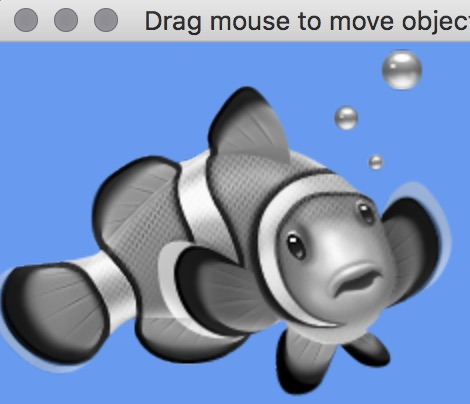

## About

This is a simple Lazarus project that displays a 2D image using Apple's Metal Framework. Dragging the mouse moves the position of the image. The Metal computer shader is only run once when the image is loaded, and it converts the color bitmap image to a grayscale image. Subsequently, the grayscale image is drawn to screen with a standard Metal fragment shader. Only the small section of code within the `IFDEF COMPUTE` block of the mtlcompute.pas handles the computation.

Another example of a compute shader is provided in the volume rendering project, where the gradients are computed using a 3D blur followed by a 3D Sobel filter.

 - This project is very similar to an Apple [XCode project](https://developer.apple.com/documentation/metal/hello_compute).

