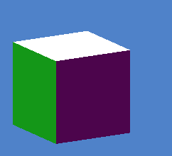

## About

This project draws a cube using Apple's Metal Framework. Each face of the cube has a different color, and each face is composed of two triangles. The cube is represented as a 3D object, and the user can spin the object using the mouse.

