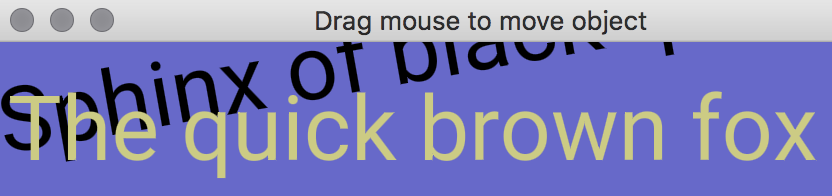

## About

This is a simple Lazarus project that displays text using the Apple Metal framework. Fonts are typically difficult to render using high performance low-level graphics. Dragging the mouse moves the position of the text.

 - This project exploits Viktor Chlumský's [Multi-channel signed distance field generator](https://github.com/Chlumsky/msdfgen).
 - This project is ports a cross platform [OpenGL](https://github.com/neurolabusc/OpenGLCoreTutorials) project.

**This project is not yet completed  [BlendingEnabled not yet implemented](http://metalbyexample.com/translucency-and-transparency/)**

