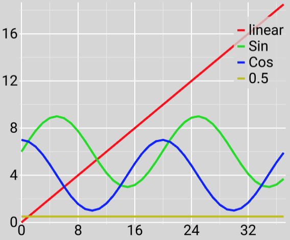

## About

This project draws graphs using Apple's Metal Framework. It uses the units developed for the [lines](../lines/) and [font](../font/) projects. The project can open and save text files (where each column of the text file is a different line, and each line of the text file is a different sample). One can choose different backgrounds (dark, blue, white, gray), modes (raw values, normalized, percent change), and select whether to display node markers.

 - Drawing lines is with Metal/OpenGL/WebGL/Vulkan is surprisingly [hard](https://blog.mapbox.com/drawing-antialiased-lines-with-opengl-8766f34192dc). The basic shape is the triangle, and one needs to consider the miter where a line bends. This issue is [often discussed](https://mattdesl.svbtle.com/drawing-lines-is-hard). This project uses a [simple miter joint](https://forum.libcinder.org/topic/smooth-thick-lines-using-geometry-shader).

