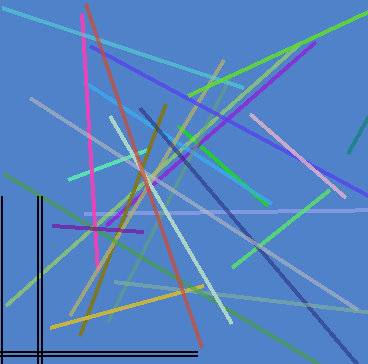

## About

This project draws lines using Apple's Metal Framework. The line vertices are retained on the graphics card, so data does not need to be transferred with between the CPU and GPU unless the lines are modified.

Line drawing in classic OpenGL used to be a simple affair. Back in the days of OpenGL's immediate mode you could simply draw a line by requesting a desired color and width as well as specifying the endpoints:
```
glLineWidth(3.0);
glColor3f(1.0, 0.0, 0.0)
glBegin(GL_LINES);
 glVertex3f(x[i],y[i],z[i]);
 glVertex3f(x[i+1],y[i+1],z[i+1]);
glEnd();
```
However modern low-level graphics APIs (Metal, Vulkan, DirectX, OpenGL Core) no longer allow this. First of all, modern APIs only allow line widths up to one pixel - which can be hairline thickness on a high-DPI monitor. Therefore, we need to describe a line as two adjacent triangles, creating a rectangle with the desired width. Second, note that with classic OpenGL we generate a drawing call for each vertex, and we have to resend each of these calls with every frame rate. In contrast, with modern APIs we send all the vertices as a single block of memory, and it is retained on the graphics card. Therefore, we do not need to transfer the information for each frame.

With Ryan's Metal wrapper sending our lines looks like this:
```
  MTLSetShader(shaderPipeline);
  if isRedraw then begin //only update buffer if something has changed
     vertexBuffer := Ctx.renderView.device.newBufferWithBytes_length_options(@g2Dvnc[0], numVertices*sizeof(TVtxClr), MTLResourceStorageModeShared);
     isRedraw := false;
  end;
  vertUniforms.viewportSize := V2(Ctx.Width, Ctx.Height);
  vertUniforms.viewportSizeDivTwo := V2(Ctx.Width/2.0, Ctx.Height/2.0);
  vertUniforms.TwoDivViewportSize := V2(2.0/Ctx.Width, 2.0/Ctx.Height);
  MTLSetVertexBuffer(vertexBuffer, 0, 0);
  MTLSetVertexBytes(@vertUniforms, sizeof(vertUniforms), 1);
  MTLDraw(MTLPrimitiveTypeTriangle, 0, numVertices);
```
The redraw flag is only generated if our lines are changed. During each frame we specify the size of our screen (in case the window size changed) and that we want all of our lines drawn. Therefore, even when there are thousands of lines, only a few tiny drawing calls need to be executed for most frames.

Note that both modern OpenGL and Metal draw using a shader program. OpenGL uses the GLSL shader language, while Metal uses its own 'metal' language. Both are variants of C. Both typically have two stages: a 'vertex shader' (that determines where each corner of a triangle will appear on the display) and a 'fragment shader' that sets the color for each pixel inside a triangle.

This project includes both Metal and GLSL ports of the same shader. The languages look similar, with minor differences. For example, with GLSL we might store the red, green, blue and alpha colors in a 'vec4', so to create an opaque red color could write 'vec4 myRgba =vec4(1.0, 0.0, 0.0, 0.0)'. In Metal we would use 'float4' instead of 'vec4'.

Both OpenGL and Metal shaders use the concept of uniforms: properties that are identical for all vertices and fragments in a drawing. In this example, we want to tell the shader the display resolution ('viewportSize') so that the lines can be scaled appropriately regardless of how large or small the user makes the program's form. In OpenGL, we typically label each uniform independently, so in this sample we would generate three drawing calls, one for each viewportSize, viewportSizeDivTwo, TwoDivViewportSize. However, with Metal Uniforms are sent as a single structure, so all the uniforms can be transferred to the graphics card with a single call. Indeed, one of the ideas of Metal is to reduce the overhead associated with multiple drawing calls.

Below is the Metal shader for this project:

```
#include <metal_stdlib>

using namespace metal;

typedef struct {
    float4 position, color;
} VertexIn;

typedef struct {
    float4 position [[position]];
    float4 color;
} VertexOut;

struct Uniforms {
	float2 viewportSize, viewportSizeDivTwo, TwoDivViewportSize;
};

// Vertex shader
vertex VertexOut vertexShader(uint vertexID [[vertex_id]],
             constant VertexIn *vertices [[buffer(0)]],
             const device Uniforms* uniforms [[ buffer(1) ]]){
    //n.b. offset by 0.5 pixels, so line with width 1 and X=1 spans 0..1.0
    float2 pixelPosition = vertices[vertexID].position.xy - 0.5;
	VertexOut out;
	//division not known at compile time is "extremely slow"
	//http://devstreaming.apple.com/videos/wwdc/2016/606oluchfgwakjbymy8/606/606_advanced_metal_shader_optimization.pdf
	float2 viewportSizeDivTwo = uniforms->viewportSizeDivTwo;
	pixelPosition -= viewportSizeDivTwo;
    float2 TwoDivViewportSize = uniforms->TwoDivViewportSize;
	out.position = vector_float4((pixelPosition * TwoDivViewportSize), 0.0, 1.0);
	out.color = vertices[vertexID].color;
	return out;
}

// Fragment shader
fragment float4 fragmentShader(VertexOut in [[stage_in]]) {
	return in.color;
}
```


