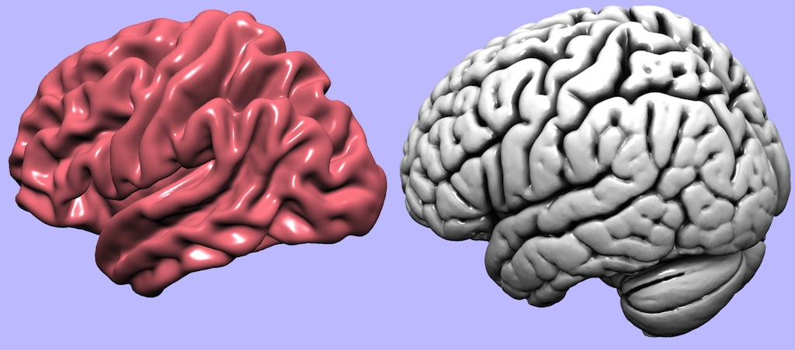

## About

This is a simple Lazarus project that demonstrates how to generate surface rendering using Apple's Metal framework. The project can open triangular meshes saved in [PLY](https://people.sc.fsu.edu/~jburkardt/data/ply/ply.html) or [OBJ](https://people.sc.fsu.edu/~jburkardt/data/obj/obj.html) format.

The image below shows two images generated by this project. The left image shows a typical mesh where the surface color is completely determined by the angle of the surface relative to the viewer and the lighting. The right image shows an image where crevices appear darker: the mesh is saved with different colors for each vertex that are based on the amount of occlusion. This mesh was created using [MeshLab's](http://www.meshlab.net/) ambient occlusion function, where the amount of shading is calculated once and saved with the mesh (a method referred to as "baked" occlusion). In contrast, the [occlusion](../occlusion/) project estimates occlusion in real time.

 - This project is ports a cross platform [OpenGL](https://github.com/neurolabusc/plyview) project.
 - This project is similar to [this project](http://metalbyexample.com/up-and-running-3/) as well as [this project](https://www.haroldserrano.com/blog/simple-lighting-in-3d-using-metal), both of which use Metal in iOS.

