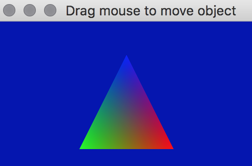

## About

The output of this project identical to the basic example. However, it can be compiled either for the Metal API, or (by changing the DEFINE at the beginning of the project) for OpenGL Core 3.3. The Metal version only runs on MacOS computers using recent versions of the operating system. The OpenGL version can be compiled for Linux, Windows and older MacOS computers.

