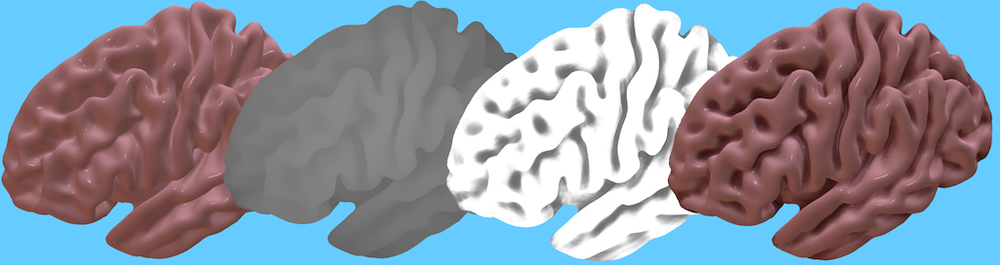

## About

This is a simple Lazarus project that demonstrates how to generate ambient occlusion using Apple's Metal framework. The project can open triangular meshes saved in [PLY](https://people.sc.fsu.edu/~jburkardt/data/ply/ply.html) or [OBJ](https://people.sc.fsu.edu/~jburkardt/data/obj/obj.html) format.

The image below illustrates the stages. The first pass is conducted in 3D space and computes the surface color (left most image) and depth (2nd image). The second pass is conducted on the 2D images from the first pass. The depth data is used to estimate the occlusion (3rd image), darkening crevices. The surface color is darkened by this occlusion to create the final image (rightmost image).

 - The screen-space ambient occlusion is based on  [Martins Upitis' GLSL code](http://devlog-martinsh.blogspot.com/2011/10/nicer-ssao.html) project.
 - Apple provides a more sophisticated demonstration, where a series of 3D passes generate a 2D geometry buffer (G-buffer) that is used for [deferred lighting](https://developer.apple.com/documentation/metal/advanced_techniques/deferred_lighting).
 - In the demo, the 3D pass generates two 2D images: a color map and a depth map. Apple's method for writing to multiple color attachments is [described in this blog](http://weblog.jamisbuck.org/2016/2/27/bloom-effect-in-metal.html).

