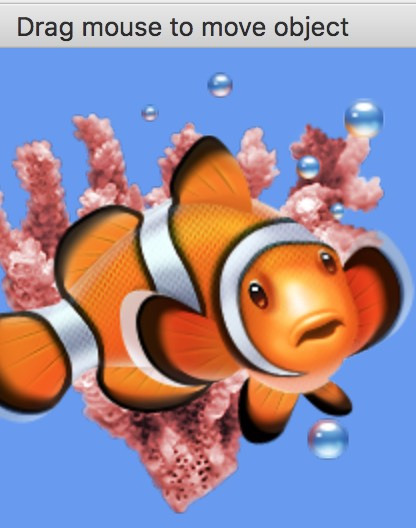

## About

This is a simple Lazarus project that displays a 2D image using Apple's Metal Framework. Dragging the mouse moves the position of the image.

 - This project is very similar to an Apple [XCode project](https://developer.apple.com/documentation/metal/basic_texturing).
 - This project is ports a cross platform [OpenGL](https://github.com/neurolabusc/OpenGLCoreTutorials) project.

