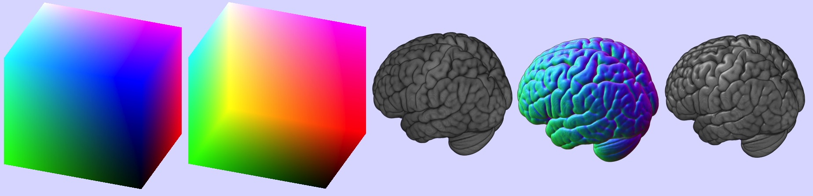

## About

This Lazarus project generates volume raycasting using Apple's Metal framework. It can load NIfTI format images.

When the program first launches, it generates and displays a simple [volumetric borg](http://paulbourke.net/geometry/borg/). However, you can open any NIftI image using the File menu. The software comes with the [mni152_2009](http://www.bic.mni.mcgill.ca/ServicesAtlases/ICBM152NLin2009) example image. Additional sample NIfTI images are included with [MRIcroGL](https://www.nitrc.org/projects/mricrogl/).

The image below shows the basic steps of [raycasting](http://www.mccauslandcenter.sc.edu/mricrogl/shaders): a cube is drawn where the red/green/blue colors correspond with the three dimensions of the image volume (the front face). One can then compute where these rays will leave the volume (the back face). For every pixel, we cast a ray (projectile) from the front face to the backface, and it absorbs the colors as it progress (the volume rendering). We can also estimate surface normals for our volume (the gradients). Combining the volume rendering and the gradients we can estimate lighting effects (the shaded volume). The project uses a compute shader to accelerate the computation of intensity gradients..

- [Philips Rideout](http://prideout.net/blog/?p=64) provides a nice description of single pass rendering.
- This project reuses surface normals and leverages ray dithering. These methods are described by [Marcus Bannerman](http://www.marcusbannerman.co.uk/articles/VolumeRendering.html).
 - This project is ports a cross platform [OpenGL](https://github.com/neurolabusc/OpenGLCoreTutorials) project.

